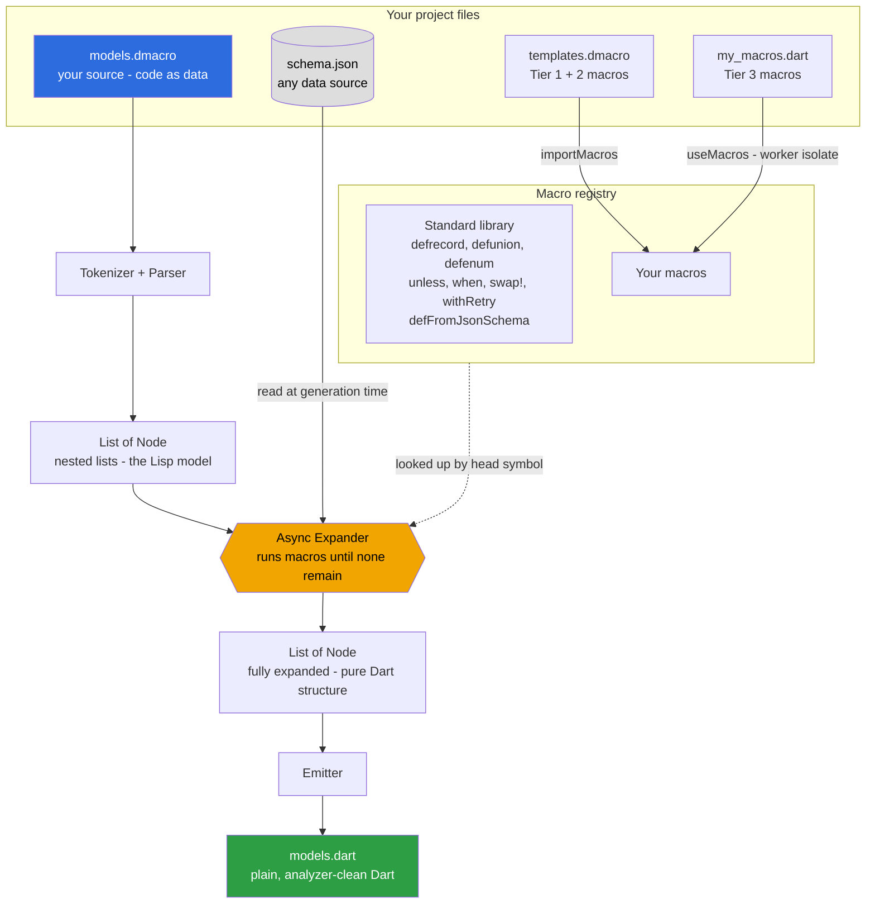

# dmacro

**Write your own Dart code generators. One function. No build daemon. No compiler plugins. No entry point.**

```dart
// lib/widget_macros.dart — your macro, your project
import 'package:dmacro/dmacro.dart';

void registerMacros() {
  defAsyncMacro('defwidget', (args) async {
    final name = unquote(args[0] as String);
    final fields = args.skip(1).cast<List>().toList();
    // ... build whatever your team actually needs
    return 'class $name extends StatelessWidget { ... }';
  });
}
```

```dart
// lib/widgets.dmacro — pull the macro in right where you use it
useMacros("lib/widget_macros.dart");

defwidget SubmitButton { String label; }
```

```bash
dart run dmacro compile lib/widgets.dmacro
```

That's the whole model. A macro is a Dart function. You load it next to where it's used with `useMacros`, and the engine calls it at generation time — before the compiler sees anything. No `tool/dmacro.dart`, no registration ceremony.

---

## The shift

Every other code-generation tool ships a **fixed menu**: `freezed` gives you immutable classes; `build_runner` + `json_serializable` gives you serialization. You pick from what they built.

dmacro ships the **means to build whatever you need**.

The built-ins — `defrecord`, `defFromJsonSchema`, `defunion` — are not the product. They are the **standard library**: working examples of what any developer can write with the same public API. `defrecord` is just the first page of a cookbook. You can re-create freezed in an afternoon. You can generate from your own schemas, your own conventions, your own data sources.

The Dart team [cancelled language-level macros](https://dart.dev/language/macros) in January 2025 because async execution inside an incremental compiler breaks hot reload. dmacro sidesteps the problem entirely: it runs as a plain preprocessor, before the compiler, so macros can `await` anything — files, HTTP, databases. That trade (one extra commit step) buys full generative power.

---

## Write a macro in 5 minutes

### Step 1 — add the dependency

```yaml
# pubspec.yaml
dev_dependencies:
  dmacro:
    git: https://github.com/caglarkullu/dart-macro
```

### Step 2 — write your macro as a plain Dart function

```dart
// lib/api_macros.dart  ← just a library: a registerMacros() that defines macros
import 'package:dmacro/dmacro.dart';

void registerMacros() {
  defAsyncMacro('defapi', (args) async {
    final endpoint = unquote(args[0] as String);
    // Read your OpenAPI spec, hit your API, parse your custom schema —
    // anything you can await works here.
    return 'class ${endpoint}Client { /* generated */ }';
  });
}
```

### Step 3 — use it

```dart
// lib/api_clients.dmacro
useMacros("lib/api_macros.dart");   // or "package:my_macros/api_macros.dart"

defapi("users");
defapi("orders");
defapi("products");
```

```bash
dart run dmacro compile lib/api_clients.dmacro
# → lib/api_clients.dart  (three generated client classes)
```

The macro library is loaded in a worker isolate the moment `useMacros` runs, so it composes with the standard library and your other macros automatically. No entry point, no `runDmacro` wiring — `dart run dmacro` is the only command you need.

---

## How a macro works

In dmacro, code is data. Your source file parses to nested lists:

```
defwidget MyButton { String label; }
```
becomes
```dart
['defwidget', 'MyButton', ['String', 'label']]
```

Your macro function receives that list, transforms it, returns new structure (or a Dart source string). The engine writes it out.

```dart
defAsyncMacro('defwidget', (args) async {
  final name = args[0] as String;          // 'MyButton'
  final fields = args.skip(1).cast<List>().toList(); // [['String','label'], ...]

  return 'class $name extends StatelessWidget { ... }';
});
```

A macro sees the **structure** of the code, not just values. That's why `assertThat(amount > 0)` can put `"(amount > 0)"` in the error message — the macro receives `['>', 'amount', 0]`, not `false`. A function can never do that.

---

## Three tiers — pick your power level

### Tier 1 — template macros (no Dart needed)

Define macros inline in your `.dmacro` file. Pure substitution, no code:

```dart
defmacro guard(cond, err) {
  unless (cond) { throw Exception(err); }
}

bool createUser(String email) {
  guard(email.contains("@"), "Invalid email");
  return true;
}
```

### Tier 2 — `$map`: templates that iterate

A trailing `...rest` parameter collects variadic arguments. `$map` repeats a template over them:

```dart
defmacro requireAll(...conds) {
  $map(conds, c) { unless(c) { throw ArgumentError("requirement failed"); } }
}

void transfer(int amount, int balance) {
  requireAll(amount > 0, amount <= balance);
  // → two if-throw guard clauses, inlined
}
```

### Tier 3 — Dart-function macros (full power)

A plain Dart library, loaded with `useMacros`. Full Dart — loops, I/O, string building, anything:

```dart
// lib/schema_macros.dart
void registerMacros() {
  defAsyncMacro('defFromMySchema', (args) async {
    final path = unquote(args[0] as String);
    final schema = jsonDecode(await File(path).readAsString());

    final fields = (schema['fields'] as List).map((f) =>
      '  final ${f['type']} ${f['name']};'
    ).join('\n');

    return 'class ${schema['name']} {\n$fields\n  // ...constructor, ==, toJson\n}';
  });
}
```

```dart
// lib/models.dmacro
useMacros("lib/schema_macros.dart");
defFromMySchema("schemas/user.json");
```

The built-ins are Tier-3 macros. They are not privileged in any way — they use the same `defAsyncMacro` you do, and `useMacros` loads yours right alongside them.

---

## What the standard library gives you free

You don't have to build everything from scratch. These ship with dmacro:

### Immutable value classes

```dart
defrecord Product {
  String  id;
  String  name;
  double  price;
  String? imageUrl;
}
```

Generates: constructor, `copyWith`, deep `==`/`hashCode`, `toString`, `fromJson`, `toJson`. ~60 lines of Dart from 7. No annotations, no existing class to annotate — the macro **creates** the class.

### Types from your API spec — at generation time

```dart
defFromJsonSchema("schemas/payment.json");
defFromOpenApi("api/openapi.yaml", "User");
defAllFromJsonSchema("schemas/");      // entire directory, one line
```

Reads the file **when you run `dmacro compile`**, not at runtime. Update the spec, recompile, done. No `*.g.dart` files. No `build_runner watch`. The output imports nothing.

This is what the cancelled official Dart macros could not offer: async execution at generation time. dmacro runs before the compiler, so macros can `await` anything.

### Control flow

```dart
unless (amount > 0) { throw Exception("must be positive"); }
assertThat(email.contains("@"));   // error: "Expected: (email.contains("@"))"
withRetry(3, postJson(endpoint, payload));  // inlined loop, not a callback
swap!(a, b);                        // injects temp variable into caller's scope
```

These macros do things functions cannot: inject variables into the caller's scope, embed the source expression in an error message, inline a loop body so `return`/`break` work as expected.

### Sealed unions

```dart
defunion AuthState {
  Unauthenticated {}
  Authenticating  {}
  Authenticated   { String userId; }
  Error           { String message; }
}
```

Generates a sealed class hierarchy. Use directly with Dart pattern matching.

---

## Real-world scenarios

### Your team's boilerplate — not ours

Every Dart codebase has its own patterns. `defrecord` generates our version of an immutable class. Yours might need different conventions — snake_case constructors, custom `copyWith` behaviour, a specific `toString` format, extra interfaces. Write the macro once:

```dart
defAsyncMacro('defmodel', (args) async {
  // your conventions, your output
});
```

And every model in your project follows it consistently. When the convention changes, you change one function — not fifty classes.

### Generate from your actual data

The async superpower: your macros can read anything at generation time.

```dart
defAsyncMacro('defFromInternalApi', (args) async {
  final endpoint = unquote(args[0] as String);
  final spec = jsonDecode(await http.get(Uri.parse(endpoint)));
  // generate Dart types from live API spec
});
```

```dart
// models.dmacro
useMacros("lib/internal_api_macros.dart");
defFromInternalApi("https://api.internal/schema/v2");
```

CI runs `dart run dmacro compile lib/models.dmacro` — the types are always current.

### Share macros across a project

Factor out common template macros into a shared file:

```dart
// lib/macros/validators.dmacro
defmacro requireNonEmpty(val, msg) {
  unless (val.isNotEmpty) { throw Exception(msg); }
}
```

```dart
// lib/models.dmacro
importMacros("lib/macros/validators.dmacro");

bool createOrder(String customerId, double amount) {
  requireNonEmpty(customerId, "Customer ID required");
  return true;
}
```

`importMacros` supports `package:` URIs too — resolves via `.dart_tool/package_config.json`.

---

## Quick reference

### CLI

```bash
dart run dmacro compile lib/models.dmacro    # compile one file
dart run dmacro compile lib/                 # compile a directory
dart run dmacro compile lib/ --check         # CI: exit non-zero if stale
dart run dmacro watch lib/                   # recompile on save
dart run dmacro trace lib/models.dmacro      # print each expansion step
```

One command for everything. Your own Dart-function macros are pulled in by `useMacros("…")` inside the source file — no separate entry point to build or invoke.

### Inline blocks in `.dart` files

No `.dmacro` file required — embed macros in an existing `.dart` file:

```dart
// lib/models.dart
// @@dmacro
defrecord Point { double x; double y; }
// @@end
```

After `dmacro compile lib/models.dart`, the macro source is preserved as comments and the generated class appears below `// @@generated`. Edit the comments, re-run to regenerate.

### Argument shapes

| You write | Your macro receives |
|---|---|
| `m(foo)` | `'foo'` (bare identifier) |
| `m("foo")` | `'"foo"'` — strip with `unquote(arg as String)` |
| `m(42)` | `42` (int) |
| `m(x > 0)` | `['>', 'x', 0]` |
| `m(f(a, b))` | `['f', 'a', 'b']` |
| Block syntax `m Name { T f; }` | `['m', 'Name', ['T', 'f']]` |

### Macro API

In your macro library (a Dart file with a `registerMacros()` function):

```dart
defmacro('name', (args) { ... });           // sync, returns Node
defAsyncMacro('name', (args) async { ... }); // async, can await I/O
unquote(arg as String)                       // strip surrounding quotes
gensym('tmp')                                // unique name per compile
$splice([node1, node2])                      // splice multiple nodes into parent
```

In your `.dmacro` source, to load macros and templates:

```dart
useMacros("lib/my_macros.dart");                  // Dart-function macros (Tier 3)
useMacros("package:team/macros.dart#registerX");  // a named registration function
importMacros("lib/templates.dmacro");             // template macros (Tier 1/2)
```

All exported from `package:dmacro/dmacro.dart`. The `tool/dmacro.dart` +
`runDmacro` entry point still works if you prefer registering macros in code,
but `useMacros` means you rarely need it.

---

## Comparison

| | **dmacro** | freezed + build_runner | Official Dart macros |
|---|---|---|---|
| Ships today | ✅ | ✅ | ❌ cancelled Jan 2025 |
| Write your own generators | ✅ **the point** | ❌ fixed set | ✅ (was the plan) |
| Load a generator with one line, no config | ✅ `useMacros("…")` | ❌ `build.yaml` wiring | — |
| I/O at generation time | ✅ | ❌ | ❌ (broke hot reload) |
| Zero runtime dependencies | ✅ | ❌ | — |
| No build daemon | ✅ | ❌ | — |
| Inject variables into scope | ✅ | ❌ | ❌ |
| Embed source expressions in errors | ✅ | ❌ | ❌ |
| Dart-like source syntax | ✅ | ✅ | ✅ |
| Works in Flutter projects | ✅ | ✅ | — |

---

## How it works

dmacro is a **preprocessor**: it runs before the Dart compiler and rewrites
`.dmacro` source into plain `.dart`. Your source parses to nested lists, macros
(plain Dart functions) transform those lists until none remain, and the emitter
writes Dart back out.



`Node` is `dynamic` — an atom or a `List<Node>`. A macro is `(List<Node>) → Node`. Because the expander runs **outside** the compiler, a macro can `await` anything at generation time (files, HTTP, a database). The generated `.dart` is committed alongside the `.dmacro` source — like `build_runner` output, but with no daemon.

**See it all in action:** [`example/showcase/`](example/showcase/) compiles one 88-line `.dmacro` — using every capability above — into 282 lines of analyzer-clean Dart.

See [`doc/ARCHITECTURE.md`](doc/ARCHITECTURE.md) and [`doc/WRITING_MACROS.md`](doc/WRITING_MACROS.md) for the full story.

---

## Project layout

```
lib/
  dmacro.dart           Public API — import this
  src/
    core.dart           Node, expand(), emit()
    async_expand.dart   Async expander — the I/O capability
    builtins.dart       Standard library: unless, defrecord, defunion, $map, …
    schema_macros.dart  Standard library: defFromJsonSchema, useMacros, …
    macro_loader.dart   useMacros: load Dart macros in a worker isolate
    macro_worker.dart   worker-side harness for loaded macro libraries
    cli.dart            runDmacro() — the full CLI as a library
bin/
  dmacro.dart           3-line shim: calls runDmacro(args)
doc/
  WRITING_MACROS.md     The authoring guide — start here
  ARCHITECTURE.md       Design decisions
  VISION.md             The north star
example/
  showcase/             Every capability in one project (start here)
  use_macros/           useMacros: a Dart macro library, no entry point
  ecommerce/            defrecord in practice
  openapi_demo/         Types from an OpenAPI spec
```
