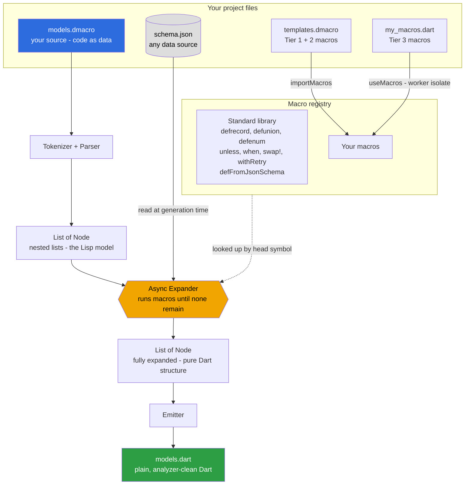

# dmacro

**Write your own Dart code generators. One function. No build daemon. No compiler plugins. No entry point.**

```dart
// lib/widget_macros.dart — your macro, your project
import 'package:dmacro/dmacro.dart';

void registerMacros() {
  defAsyncMacro('defwidget', (args) async {
    final name = unquote(args[0] as String);
    final fields = args.skip(1).cast<List>().toList();
    // ... build whatever your team actually needs
    return 'class $name extends StatelessWidget { ... }';
  });
}
```

```dart
// lib/widgets.dmacro — pull the macro in right where you use it
useMacros("lib/widget_macros.dart");

defwidget SubmitButton { String label; }
```

```bash
dart run dmacro compile lib/widgets.dmacro
```

That's the whole model. A macro is a Dart function. You load it next to where it's used with `useMacros`, and the engine calls it at generation time — before the compiler sees anything. No `tool/dmacro.dart`, no registration ceremony.

---

## The shift

Every other code-generation tool ships a **fixed menu**: `freezed` gives you immutable classes; `build_runner` + `json_serializable` gives you serialization. You pick from what they built.

dmacro ships the **means to build whatever you need**.

The built-ins — `defrecord`, `defFromJsonSchema`, `defunion` — are not the product. They are the **standard library**: working examples of what any developer can write with the same public API. `defrecord` is just the first page of a cookbook. You can re-create freezed in an afternoon. You can generate from your own schemas, your own conventions, your own data sources.

The Dart team [cancelled language-level macros](https://dart.dev/language/macros) in January 2025 because async execution inside an incremental compiler breaks hot reload. dmacro sidesteps the problem entirely: it runs as a plain preprocessor, before the compiler, so macros can `await` anything — files, HTTP, databases. That trade (one extra commit step) buys full generative power.

---

## Write a macro in 5 minutes

### Step 1 — add the dependency

```yaml
# pubspec.yaml
dev_dependencies:
  dmacro:
    git: https://github.com/caglarkullu/dart-macro
```

### Step 2 — write your macro as a plain Dart function

```dart
// lib/api_macros.dart  ← just a library: a registerMacros() that defines macros
import 'package:dmacro/dmacro.dart';

void registerMacros() {
  defAsyncMacro('defapi', (args) async {
    final endpoint = unquote(args[0] as String);
    // Read your OpenAPI spec, hit your API, parse your custom schema —
    // anything you can await works here.
    return 'class ${endpoint}Client { /* generated */ }';
  });
}
```

### Step 3 — use it

```dart
// lib/api_clients.dmacro
useMacros("lib/api_macros.dart");   // or "package:my_macros/api_macros.dart"

defapi("users");
defapi("orders");
defapi("products");
```

```bash
dart run dmacro compile lib/api_clients.dmacro
# → lib/api_clients.dart  (three generated client classes)
```

The macro library is loaded in a worker isolate the moment `useMacros` runs, so it composes with the standard library and your other macros automatically. No entry point, no `runDmacro` wiring — `dart run dmacro` is the only command you need.

---

## How a macro works

In dmacro, code is data. Your source file parses to nested lists:

```
defwidget MyButton { String label; }
```
becomes
```dart
['defwidget', 'MyButton', ['String', 'label']]
```

Your macro function receives that list, transforms it, returns new structure (or a Dart source string). The engine writes it out.

```dart
defAsyncMacro('defwidget', (args) async {
  final name = args[0] as String;          // 'MyButton'
  final fields = args.skip(1).cast<List>().toList(); // [['String','label'], ...]

  return 'class $name extends StatelessWidget { ... }';
});
```

A macro sees the **structure** of the code, not just values. That's why `assertThat(amount > 0)` can put `"(amount > 0)"` in the error message — the macro receives `['>', 'amount', 0]`, not `false`. A function can never do that.

---

## Three tiers — pick your power level

### Tier 1 — template macros (no Dart needed)

Define macros inline in your `.dmacro` file. Pure substitution, no code:

```dart
defmacro guard(cond, err) {
  unless (cond) { throw Exception(err); }
}

bool createUser(String email) {
  guard(email.contains("@"), "Invalid email");
  return true;
}
```

### Tier 2 — `$map`: templates that iterate

A trailing `...rest` parameter collects variadic arguments. `$map` repeats a template over them:

```dart
defmacro requireAll(...conds) {
  $map(conds, c) { unless(c) { throw ArgumentError("requirement failed"); } }
}

void transfer(int amount, int balance) {
  requireAll(amount > 0, amount <= balance);
  // → two if-throw guard clauses, inlined
}
```

### Tier 3 — Dart-function macros (full power)

A plain Dart library, loaded with `useMacros`. Full Dart — loops, I/O, string building, anything:

```dart
// lib/schema_macros.dart
void registerMacros() {
  defAsyncMacro('defFromMySchema', (args) async {
    final path = unquote(args[0] as String);
    final schema = jsonDecode(await File(path).readAsString());

    final fields = (schema['fields'] as List).map((f) =>
      '  final ${f['type']} ${f['name']};'
    ).join('\n');

    return 'class ${schema['name']} {\n$fields\n  // ...constructor, ==, toJson\n}';
  });
}
```

```dart
// lib/models.dmacro
useMacros("lib/schema_macros.dart");
defFromMySchema("schemas/user.json");
```

The built-ins are Tier-3 macros. They are not privileged in any way — they use the same `defAsyncMacro` you do, and `useMacros` loads yours right alongside them.

---

## What the standard library gives you free

You don't have to build everything from scratch. These ship with dmacro:

### Immutable value classes

```dart
defrecord Product {
  String  id;
  String  name;
  double  price;
  String? imageUrl;
}
```

Generates: constructor, `copyWith`, deep `==`/`hashCode`, `toString`, `fromJson`, `toJson`. ~60 lines of Dart from 7. No annotations, no existing class to annotate — the macro **creates** the class.

### Types from your API spec — at generation time

```dart
defFromJsonSchema("schemas/payment.json");
defFromOpenApi("api/openapi.yaml", "User");
defAllFromJsonSchema("schemas/");      // entire directory, one line
```

Reads the file **when you run `dmacro compile`**, not at runtime. Update the spec, recompile, done. No `*.g.dart` files. No `build_runner watch`. The output imports nothing.

This is what the cancelled official Dart macros could not offer: async execution at generation time. dmacro runs before the compiler, so macros can `await` anything.

### Control flow

```dart
unless (amount > 0) { throw Exception("must be positive"); }
assertThat(email.contains("@"));   // error: "Expected: (email.contains("@"))"
withRetry(3, postJson(endpoint, payload));  // inlined loop, not a callback
swap!(a, b);                        // injects temp variable into caller's scope
```

These macros do things functions cannot: inject variables into the caller's scope, embed the source expression in an error message, inline a loop body so `return`/`break` work as expected.

### Sealed unions

```dart
defunion AuthState {
  Unauthenticated {}
  Authenticating  {}
  Authenticated   { String userId; }
  Error           { String message; }
}
```

Generates a sealed class hierarchy. Use directly with Dart pattern matching.

---

## Real-world scenarios

### Your team's boilerplate — not ours

Every Dart codebase has its own patterns. `defrecord` generates our version of an immutable class. Yours might need different conventions — snake_case constructors, custom `copyWith` behaviour, a specific `toString` format, extra interfaces. Write the macro once:

```dart
defAsyncMacro('defmodel', (args) async {
  // your conventions, your output
});
```

And every model in your project follows it consistently. When the convention changes, you change one function — not fifty classes.

### Generate from your actual data

The async superpower: your macros can read anything at generation time.

```dart
defAsyncMacro('defFromInternalApi', (args) async {
  final endpoint = unquote(args[0] as String);
  final spec = jsonDecode(await http.get(Uri.parse(endpoint)));
  // generate Dart types from live API spec
});
```

```dart
// models.dmacro
useMacros("lib/internal_api_macros.dart");
defFromInternalApi("https://api.internal/schema/v2");
```

CI runs `dart run dmacro compile lib/models.dmacro` — the types are always current.

### Share macros across a project

Factor out common template macros into a shared file:

```dart
// lib/macros/validators.dmacro
defmacro requireNonEmpty(val, msg) {
  unless (val.isNotEmpty) { throw Exception(msg); }
}
```

```dart
// lib/models.dmacro
importMacros("lib/macros/validators.dmacro");

bool createOrder(String customerId, double amount) {
  requireNonEmpty(customerId, "Customer ID required");
  return true;
}
```

`importMacros` supports `package:` URIs too — resolves via `.dart_tool/package_config.json`.

---

## Quick reference

### CLI

```bash
dart run dmacro compile lib/models.dmacro    # compile one file
dart run dmacro compile lib/                 # compile a directory
dart run dmacro compile lib/ --check         # CI: exit non-zero if stale
dart run dmacro watch lib/                   # recompile on save
dart run dmacro trace lib/models.dmacro      # print each expansion step
```

One command for everything. Your own Dart-function macros are pulled in by `useMacros("…")` inside the source file — no separate entry point to build or invoke.

### Inline blocks in `.dart` files

No `.dmacro` file required — embed macros in an existing `.dart` file:

```dart
// lib/models.dart
// @@dmacro
defrecord Point { double x; double y; }
// @@end
```

After `dmacro compile lib/models.dart`, the macro source is preserved as comments and the generated class appears below `// @@generated`. Edit the comments, re-run to regenerate.

### Argument shapes

| You write | Your macro receives |
|---|---|
| `m(foo)` | `'foo'` (bare identifier) |
| `m("foo")` | `'"foo"'` — strip with `unquote(arg as String)` |
| `m(42)` | `42` (int) |
| `m(x > 0)` | `['>', 'x', 0]` |
| `m(f(a, b))` | `['f', 'a', 'b']` |
| Block syntax `m Name { T f; }` | `['m', 'Name', ['T', 'f']]` |

### Macro API

In your macro library (a Dart file with a `registerMacros()` function):

```dart
defmacro('name', (args) { ... });           // sync, returns Node
defAsyncMacro('name', (args) async { ... }); // async, can await I/O
unquote(arg as String)                       // strip surrounding quotes
gensym('tmp')                                // unique name per compile
$splice([node1, node2])                      // splice multiple nodes into parent
```

In your `.dmacro` source, to load macros and templates:

```dart
useMacros("lib/my_macros.dart");                  // Dart-function macros (Tier 3)
useMacros("package:team/macros.dart#registerX");  // a named registration function
importMacros("lib/templates.dmacro");             // template macros (Tier 1/2)
```

All exported from `package:dmacro/dmacro.dart`. The `tool/dmacro.dart` +
`runDmacro` entry point still works if you prefer registering macros in code,
but `useMacros` means you rarely need it.

---

### 9. YAML OpenAPI specs

`defFromOpenApi` accepts `.yaml` and `.yml` files in addition to `.json` — no external dependencies:

```dart
defFromOpenApi("api/openapi.yaml", "User");
defFromOpenApi("api/openapi.yaml", "Order");
```

The built-in YAML parser handles block and flow mappings/sequences, quoted scalars, block scalars (`|`/`>`), and `#` comments — the full subset needed for real-world OpenAPI specs.

---

## Syntax

dmacro files look like Dart. The `.dmacro` extension signals the preprocessor.

```dart
// models.dmacro

defrecord User {
  String  id;
  String  email;
  String? displayName;
  bool    isVerified;
}

defunion AuthState {
  Unauthenticated {}
  Authenticating  {}
  Authenticated   { User user; }
  Error           { String message; }
}

bool validateEmail(String email) {
  unless (email.contains("@")) {
    throw Exception("Invalid email: $email");
  }
  return true;
}
```

Compile it:

```bash
dart run bin/dmacro.dart compile models.dmacro
# writes models.dart
```

There is also an S-expression syntax (`.sexp`) for the full Lisp experience — see [`example/payment.sexp`](example/payment.sexp).

---

## Built-in macros

| Macro | What it generates | Why a function can't do this |
|---|---|---|
| `defrecord Name { ... }` | Immutable class: fields, constructor, `copyWith`, deep `==`/`hashCode`, `toString`, **`fromJson`/`toJson`** with camelCase JSON keys | Functions can't generate class declarations |
| `defrecord(snake_case) Name { ... }` | Same as `defrecord` but JSON keys are converted to snake_case (`orderId` → `"order_id"`) | Covers the common case where the API uses snake_case and Dart uses camelCase |
| `@json_key("name") Type field;` | Per-field JSON key override — wins over camelCase and snake_case | N/A — field annotation |
| `defunion Name { ... }` | Sealed class hierarchy | Same |
| `defmacro name(params) { ... }` | User-defined template macro, registered for use in the same file | Functions run at call time with values; macros run at expand time with code |
| `defmacro(declaration) name(params) { ... }` | User macro with output-type validation — errors at call time if output isn't a declaration | Functions have no way to validate the shape of their return value as code |
| `defmacro(expression) name(params) { ... }` | User macro validated to produce an expression | Same |
| `defmacro(statement) name(params) { ... }` | User macro validated to produce a statement | Same |
| `importMacros("path")` | Load macro definitions from another `.dmacro` / `.sexp` file; supports `package:` URIs | Functions can't register macros at compile time |
| `defFromJsonSchema("path")` | `defrecord` from a JSON Schema file; `$defs`/`definitions` blocks and `oneOf` are supported | Functions run at runtime; I/O during generation requires a macro |
| `defFromOpenApi("path", "Name")` | `defrecord` (or `defunion` for `oneOf`) from an OpenAPI `components/schemas` entry; accepts `.json`, `.yaml`, or `.yml` | Same |
| `defAllFromJsonSchema("dir/")` | One `defrecord` per `.json` file in a directory | Same |
| `unless (cond) { ... }` | `if (!(cond)) { ... }` | Convenience only — could be a function but this reads better |
| `when (cond) { ... }` | `if (cond) { ... }` | Same |
| `assertThat(expr)` | `if (!expr) throw AssertionError("Expected: <source>")` | Functions receive `false`, not the expression that produced it |
| `swap!(a, b)` | `final _tmp = a; a = b; b = _tmp;` | Functions receive values, not variable names |
| `withRetry(n, expr)` | Inline `for` loop with `try/catch` | Body is inlined, not a callback — `return`/`break` work normally; a higher-order function can't do this |

---

## Workflow

```
you write           dmacro compiles           you commit
──────────          ──────────────            ──────────
models.dmacro  →    models.dart          →    models.dart
                    (full Dart class)          (not models.dmacro)
```

The `.dart` file is the output — your Flutter/Dart app imports it as normal. The `.dmacro` file is the source. Commit both.

### Flutter project integration

In a Flutter project, run `dmacro watch` alongside `flutter run`. The VS Code extension does this automatically — it recompiles `.dmacro` files on save and triggers hot reload 500 ms later. Manually:

```bash
# Terminal 1 — Flutter dev server
flutter run

# Terminal 2 — dmacro watcher
dart run bin/dmacro.dart watch lib/models/
```

Save a `.dmacro` file → dmacro regenerates the `.dart` → Flutter hot-reloads.

The generated `.dart` files are plain Dart — they work with `Provider`, `Riverpod`, `Bloc`, and any other state management. No special integration required; they're just immutable value classes.

**Merge conflicts in generated files:** treat them the same as `build_runner` output. Resolve the conflict in the `.dmacro` source file, run `dart run bin/dmacro.dart compile lib/models/` to regenerate, then commit the fresh output.

### Installation

```bash
# From pub.dev (after publish — use dart pub global for CLI access):
dart pub global activate dmacro

# From source:
git clone https://github.com/caglarkullu/dart-macro
cd dart-macro && dart pub get
dart run bin/dmacro.dart compile <file>
```

> **Note:** dmacro is not yet published to pub.dev. The pub.dev publish step is tracked in the backlog. Until then, install from source or pin a git dependency in `pubspec.yaml`.

### Watch mode (recompiles on every save)

```bash
dart run bin/dmacro.dart watch lib/
```

**Cascade recompile:** if you edit a shared macro library (e.g. `shared_templates.dmacro`), every `.dmacro` file that imports it via `importMacros` is automatically recompiled — no manual intervention needed.

### Incremental builds (content-hash cache)

dmacro tracks a FNV-1a fingerprint for each compiled file in `.dart_tool/dmacro/cache.json`. The fingerprint covers the source file, every `importMacros` target, and every external file read at generation time (JSON schemas, OpenAPI specs). Re-running compile on an unchanged file skips the work entirely:

```bash
$ dart run bin/dmacro.dart compile lib/models/
✓ lib/models/user.dmacro → lib/models/user.dart

$ dart run bin/dmacro.dart compile lib/models/
↷ lib/models/user.dmacro (unchanged)   # skipped — fingerprint matches
```

This keeps repeated CI runs fast even when schema macros perform file I/O.

### CI staleness check

```bash
dart run bin/dmacro.dart compile lib/ --check
# exits non-zero if any .dart is out of date
```

### Trace macro expansions

```bash
dart run bin/dmacro.dart trace models.dmacro
# prints each macro expansion step — useful for debugging generated code
```

### Field-level error attribution

By default, `dart analyze` errors on generated code map to the `defrecord` declaration line. Add `--field-origins` to get per-field precision:

```bash
dart run bin/dmacro.dart compile models.dmacro --field-origins
# embeds // @dmacro-origin: models.dmacro:5 before each generated field
```

This adds one comment per field in the generated file. Useful when you have type errors on specific fields; unnecessary noise otherwise.

### VS Code extension

The `vscode-ext/` directory contains a VS Code extension that gives you:

- Syntax highlighting for `.dmacro` and `.sexp` files
- Compile on save (runs `dmacro compile` automatically)
- Errors shown as red squiggles in the editor
- Commands:
  - **dmacro: Compile File** — compile the active `.dmacro` or `.sexp` file
  - **dmacro: Compile Workspace** — compile all sources in the workspace
  - **dmacro: Expand Macro at Cursor** — run `dmacro trace` on the active file and show the full expansion tree in a side panel; useful for understanding what a macro generates without opening the `.dart` output file

**Install steps:**

1. Install [Node.js](https://nodejs.org) if you don't have it.

2. Build the `.vsix` package:

   ```bash
   cd vscode-ext
   npm install
   npm run package        # produces dmacro-0.1.0.vsix
   ```

3. Install in VS Code:
   - Open the Extensions panel (`Ctrl+Shift+X` / `Cmd+Shift+X`)
   - Click the `···` menu at the top-right of the panel
   - Choose **Install from VSIX…**
   - Select `vscode-ext/dmacro-0.1.0.vsix`

4. Reload VS Code when prompted.

**Settings** (VS Code `settings.json`):

| Setting | Default | Description |
|---|---|---|
| `dmacro.cliPath` | `""` | Absolute path to the `dmacro` CLI binary. Leave empty to use `dart run bin/dmacro.dart` |
| `dmacro.formatOnCompile` | `true` | Run `dart format` on the generated `.dart` file after each compile |
| `dmacro.analyzeOnCompile` | `true` | Run `dart analyze` after compile and surface errors as VS Code diagnostics |
| `dmacro.hotReloadOnCompile` | `true` | Trigger Flutter hot reload 500 ms after a successful compile (requires an active debug session) |

**Try it in development** (no build needed):

```bash
cd vscode-ext && npm install
# open vscode-ext/ in VS Code, then press F5 — launches an Extension Development Host
```

---

## Comparison

| | **dmacro** | freezed + build_runner | Official Dart macros |
|---|---|---|---|
| Ships today | ✅ | ✅ | ❌ cancelled Jan 2025 |
| Write your own generators | ✅ **the point** | ❌ fixed set | ✅ (was the plan) |
| Load a generator with one line, no config | ✅ `useMacros("…")` | ❌ `build.yaml` wiring | — |
| I/O at generation time | ✅ | ❌ | ❌ (broke hot reload) |
| Zero runtime dependencies | ✅ | ❌ | — |
| No build daemon | ✅ | ❌ | — |
| Inject variables into scope | ✅ | ❌ | ❌ |
| Embed source expressions in errors | ✅ | ❌ | ❌ |
| Dart-like source syntax | ✅ | ✅ | ✅ |
| Works in Flutter projects | ✅ | ✅ | — |

---

## How it works

dmacro is a **preprocessor**: it runs before the Dart compiler and rewrites
`.dmacro` source into plain `.dart`. Your source parses to nested lists, macros
(plain Dart functions) transform those lists until none remain, and the emitter
writes Dart back out. Dart syntax the parser does not model (switch expressions,
record patterns, extension types, etc.) is wrapped in an `OpaqueNode` and emitted
verbatim — so any valid Dart can coexist with macro calls inside `.dmacro` files.



`Node` is `dynamic` — an atom or a `List<Node>`. A macro is `(List<Node>) → Node`. Because the expander runs **outside** the compiler, a macro can `await` anything at generation time (files, HTTP, a database). The generated `.dart` is committed alongside the `.dmacro` source — like `build_runner` output, but with no daemon.

**See it all in action:** [`example/showcase/`](example/showcase/) compiles one 88-line `.dmacro` — using every capability above — into 282 lines of analyzer-clean Dart.

See [`doc/ARCHITECTURE.md`](doc/ARCHITECTURE.md) and [`doc/WRITING_MACROS.md`](doc/WRITING_MACROS.md) for the full story.

---

## Project layout

```
lib/
  dmacro.dart           Public API — import this
  src/
    core.dart           Node, expand(), emit(), OpaqueNode (verbatim passthrough)
    async_expand.dart   Async expander — the I/O capability
    builtins.dart       Standard library: unless, defrecord, defunion, $map, …
    schema_macros.dart  Standard library: defFromJsonSchema, useMacros, …
    macro_loader.dart   useMacros: load Dart macros in a worker isolate
    macro_worker.dart   worker-side harness for loaded macro libraries
    dep_graph.dart      Reverse-dependency DAG — cascade recompile in watch mode
    gen_cache.dart      FNV-1a content-hash cache — skip unchanged files
    cli.dart            runDmacro() — the full CLI as a library
bin/
  dmacro.dart           3-line shim: calls runDmacro(args)
doc/
  WRITING_MACROS.md     The authoring guide — start here
  ARCHITECTURE.md       Design decisions
  VISION.md             The north star
example/
  showcase/             Every capability in one project (start here)
  use_macros/           useMacros: a Dart macro library, no entry point
  ecommerce/            defrecord in practice
  openapi_demo/         Types from an OpenAPI spec
```
