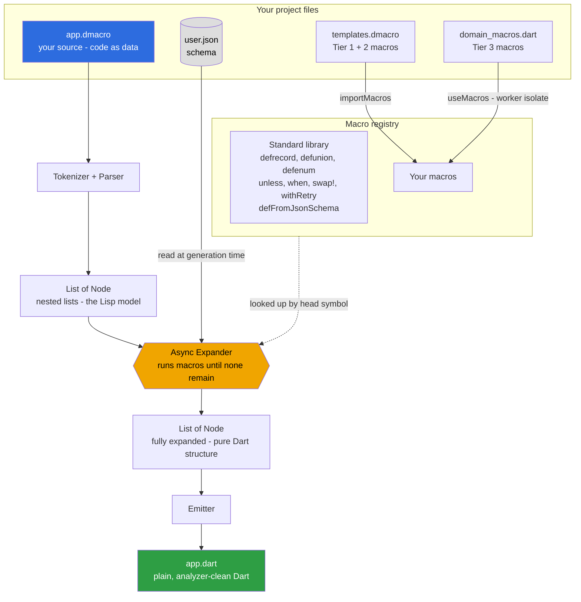

# dmacro showcase — every capability in one project

One source file, [`app.dmacro`](app.dmacro) (88 lines), generates
[`app.dart`](app.dart) (282 lines of clean, analyzer-passing Dart). It exercises
the whole tool: the standard library, all three macro-authoring tiers,
generation-time I/O, and the macros that do things a function cannot.

```bash
dart run dmacro compile example/showcase/app.dmacro
# from this repo:
dart run bin/dmacro.dart compile example/showcase/app.dmacro
```

## How dmacro works

dmacro is a **preprocessor**: it runs before the Dart compiler and rewrites
`.dmacro` source into plain `.dart`. Code is data — your source parses to nested
lists, macros (plain Dart functions) transform those lists, and the emitter
writes Dart back out.



The key move: because dmacro sits **outside** the compiler, a macro can `await`
anything at generation time — read a JSON schema, hit an API, query a database —
which the cancelled official Dart macros could not do.

## What the showcase demonstrates

| In `app.dmacro` | Capability | Tier / source |
|---|---|---|
| `useMacros("…/domain_macros.dart")` | Load Dart-function macros, **no entry point** | Tier 3 |
| `importMacros("…/templates.dmacro")` | Share template macros across files | Tier 1 + 2 |
| `defenum Role { … }` | Generated Dart `enum` with `fromJson`/`toJson` | standard library |
| `defrecord Account { … }` | Immutable value class — ctor, `copyWith`, `==`, `hashCode`, `toString`, JSON. **Enum-aware** serialization for the `Role` field | standard library |
| `defunion AuthState { … }` | Sealed class hierarchy for pattern matching | standard library |
| `defFromJsonSchema("…/user.json")` | **Types generated from a JSON schema, read at generation time** | async I/O |
| `defendpoint CreateUserRequest { … }` | Your own macro builds a class from block syntax | Tier 3 (`domain_macros.dart`) |
| `notBlank(email, …)` | Template guard macro | Tier 1 (`templates.dmacro`) |
| `requireAll(a, b, c)` | Variadic `...rest` + `$map` — one guard per arg | Tier 2 (`templates.dmacro`) |
| `assertRange(age, 0, 150)` | Your sync macro; sees the **expression**, embeds it in the error | Tier 3 (`domain_macros.dart`) |
| `unless`, `when`, `assertThat` | Inline control-flow macros — zero runtime overhead | standard library |
| `withRetry(3, deliver(…))` | Inlines a retry loop into the caller (not a callback) | standard library |
| `swap!(lo, hi)` | Injects a temp into the **caller's scope** — a function can't | standard library |

## The files

```
showcase/
  app.dmacro              ← the one source that uses everything
  app.dart                ← generated output (committed, analyzer-clean)
  templates.dmacro        ← Tier 1 + Tier 2 template macros (importMacros)
  macros/domain_macros.dart ← Tier 3 Dart-function macros (useMacros)
  schemas/user.json       ← input the schema macro reads at generation time
```

Edit `app.dmacro`, recompile, and the generated `app.dart` updates — commit it
alongside the source, just like `build_runner` output but with no daemon.
